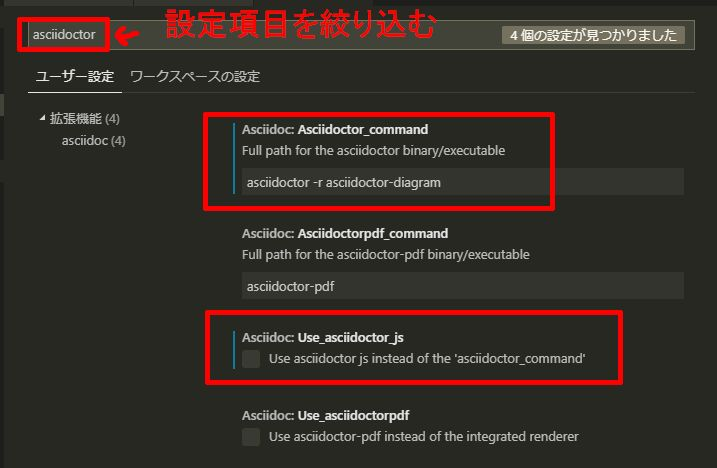
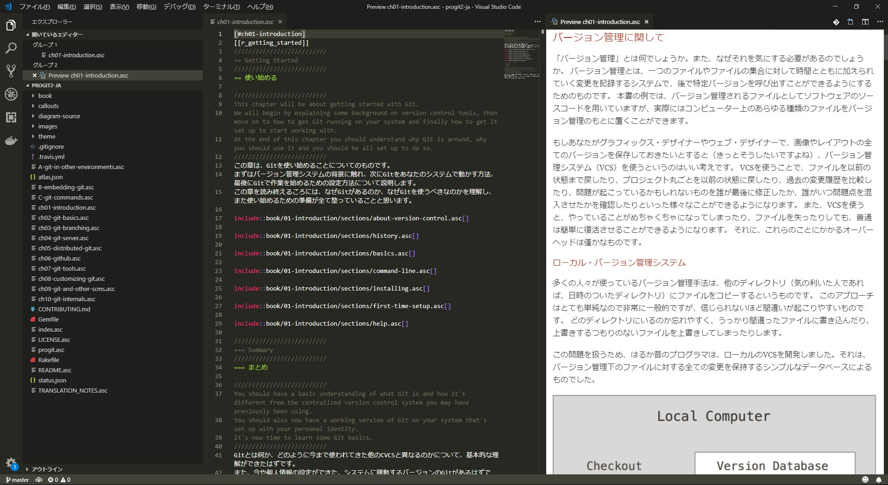

# Asciidocの編集環境を作る

# はじめに
Asciidocの編集環境を構築する手順を解説します。
Asciidocで文章を書く利点とかは[ここ]()を参照。

# 構築する環境
- ruby(ubuntuなら多分デフォルトで入っている)
- graphviz(グラフ描くのに何かと使う)
- jdk8(PlantUMLでUML描くのに必要)
- Visual Studio Code
- Asciidoctor

# 想定環境
以下の環境を想定して環境構築方法を解説します。
- Windows
    - chocolateyがインストール済み
        - 環境構築がまだの場合は[こちら](https://qiita.com/hyt126/items/7ea279327da05a63ec23)を参照
- Linux
    - ubuntu等、aptが使える環境

# Windowsでの環境構築
chocolateyを使って構築していきます。ただし、rubyのインストールに以下の注意点があるので、chocolateyを使うかは自分で判断してください。

## Windowsでの環境構築の注意点
chocolateyでcup all -yでアップデートをかけたところ、新しいバージョンのrubyがインストールされ、新しいバージョンがpathで優先されるよう自動で設定されてしまいました。
これだとgemコマンドを叩いたときに新しい方のruby環境のgemが動いてしまうので都合が悪いです。こうなった場合、追加で入った方をパスから削除する必要があると思います。

また、知らないうちにrubyの環境が複数出来て、優先度が変わるのは開発環境として嬉しくないので、rubyは手動で[windowsのインストーラー](https://rubyinstaller.org/)を使っていれるのも良いかと思います。

## インストールコマンド
```
cinst ruby -y
cinst graphviz -y
cinst jdk8 -y
cinst vscode -y
```

以降は、上記のrubyとvscodeがインストールされたあとに実行

```
gem install bundler
gem install asciidoctor
gem install asciidoctor-pdf --pre
gem install asciidoctor-pdf-cjk
gem install asciidoctor-diagram
gem install coderay
gem install rouge
gem install concurrent-ruby
code --install-extension joaompinto.asciidoctor-vscode
```

## 環境変数の設定
以降は、インストールしたバージョンに併せて読み替えてください。

pathにgraphvizのbinディレクトリの場所を追加する
```
C:\Program Files (x86)\Graphviz2.38\bin
```

GRAPHVIZ_DOTにdotの場所を追加する。
```
C:\Program Files (x86)\Graphviz2.38\bin\dot.exe
```

# Linuxでの環境構築
```
sudo apt -y install ruby
sudo apt -y install graphviz

# java setup, for plantuml
sudo add-apt-repository ppa:webupd8team/java
sudo apt -y update
sudo apt -y install oracle-java8-installer

# vscode
curl https://packages.microsoft.com/keys/microsoft.asc | gpg --dearmor > microsoft.gpg
sudo mv microsoft.gpg /etc/apt/trusted.gpg.d/microsoft.gpg
sudo sh -c 'echo "deb [arch=amd64] https://packages.microsoft.com/repos/vscode stable main" > /etc/apt/sources.list.d/vscode.list'
#↓ないとGPG エラー: https://packages.microsoft.com stable InReleaseが出る
sudo apt-key adv --keyserver keyserver.ubuntu.com --recv-keys EB3E94ADBE1229CF
sudo apt -y update
sudo apt -y install code
```

以降は、上記のrubyとvscodeがインストールされたあとに実行

```
sudo gem install bundler
sudo gem install asciidoctor
sudo gem install asciidoctor-pdf --pre
sudo gem install asciidoctor-pdf-cjk
sudo gem install asciidoctor-diagram
sudo gem install coderay
sudo gem install rouge
sudo gem install concurrent-ruby

code --install-extension joaompinto.asciidoctor-vscode
```

# Visual Studio Codeの設定
環境構築のところで入れた拡張機能によって、vscodeでasciidocのプレビューができるようになっています。
デフォルトではjavascriptのライブラリを使って、実行するようになっていますが、このままだとgrapvizなどのグラフのプレビューができないので設定を変更します。

設定→asciidoctorと絞りこんで、以下のように設定します。
- asciidotor_command
    - asciidoctor -r asciidoctor-diagram
- use_asciidoctor_js
    - false(チェックを外す)



以上で、asciidocのvscodeでプレビューしながら編集することができます。

