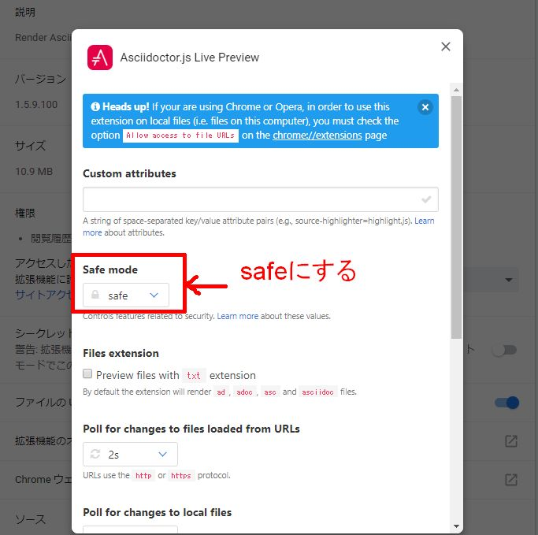
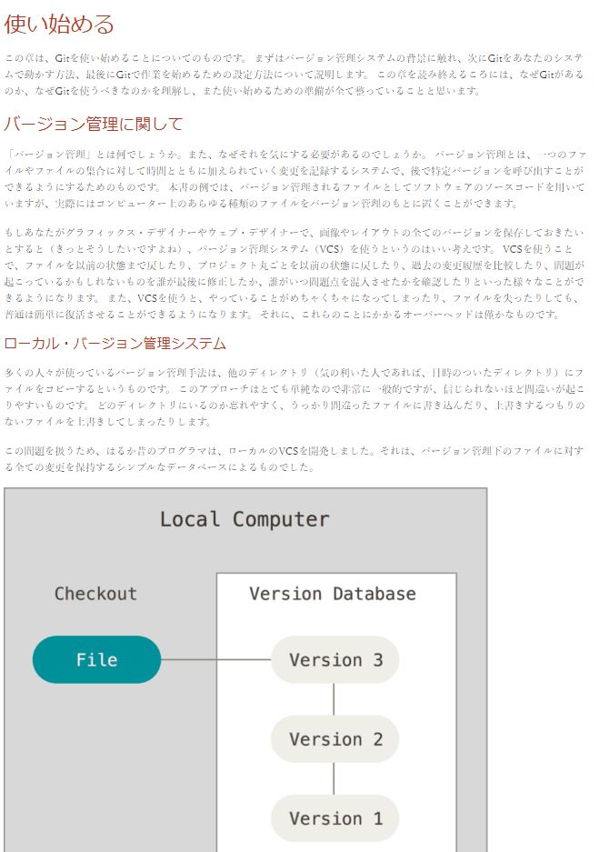

# Asciidocのプレビュー環境を作る

# はじめに
Asciidocをプレビューする環境を構築する手順を解説します。
Asciidocで文章を書く利点とかは[ここ]()を参照。

# 作業手順
1. ChromeかFirefoxに拡張機能Asciidoctor.js Live Previewを入れる。(Chrome推奨。理由は後述)
2. 拡張機能の設定を変更する

## Asciidoctor.js Live Preview
Asciidoctorの拡張機能、Chrome,Firefox用が提供されている。アドオンサイトから検索して導入する。

### Chrome推奨理由
Firefoxだとローカルにあるファイルのプレビューは出来たが、ウェブにあるファイルがブラウザ上で直接開けずダウンロードになったり、開けてもレンダリングされませんでした。よって、Chromeを推奨します。

ローカルにダウンロードしてから見る前提であればFirefoxでも特に不都合はなかったです。

## 拡張機能の設定
インストール後に拡張機能の設定を変更する。
Chromeの画面を例に解説します。

1. 拡張機能からAsciidoctor.js Live Previewの詳細を選択
2. 「ファイルのURLへのアクセスを許可する」を有効にする
3. 拡張機能オプションを選択し、「safe mode」をsafeにする。

これだけで、adoc, asciidoc, asc, adの拡張子のファイルをプレビューしてくれます。

# 拡張子毎の動作の違い
ローカルにあるadoc, asciidoc, asc, adについては、プラグインを用いてどのファイルも表示出来ます。ウェブに置かれているファイルについては拡張子毎に動作が違います。

Gitのバージョン管理サーバーと、ウェブサーバーにasciidocのファイルを置き、Chromeでアクセスして拡張子毎に動作の違いを調べ、以下の結果を得ました。

GitのサーバーについてはRAW表示したときの動作。
ブラウザ拡張機能でプレビューが見れるのを○としています。

||Github|Gitlab|Bitbucket|Gitbucket|Apacheウェブサーバー|
|:---|:---|:---|:---|:---|:---|
|**adoc**|○|○|○|○|○|
|**asciidoc**|○|○|○|○|○|
|**asc**|○|○|○|ダウンロード実行|ダウンロード実行|
|**ad**|untitled|○|untitled|untitled|○|

ローカルにファイルをダウンロードすることになしに、ブラウザ上で簡単にプレビューができるという都合を考えると、作成するファイルの拡張子はadocかasciidocが良いということになりそうです。
拡張子の長さも考慮するとadocでしょうか。

# プレビューを試す
試しにgithubで公開されているPro Git日本語版のファイルをプレビューしてみます。

1. https://github.com/progit/progit2-ja にアクセスする
2. 適当なascファイルをクリック。例えば、ch01-introduction.asc
3. RAWを押す(ascファイルを直接で開く)
4. プラグインによりレンダリングされ画像のような感じに表示されるはずです。

