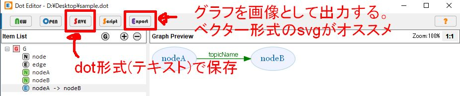
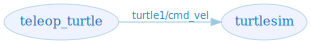

# DotEditorで分散ソフトのノードグラフを書く

# はじめに
ROSを始めとするロボットのミドルウェアでは、多く分散システムとして設計され、互いをつなぐための通信のライブラリなどが提供されています。

ロボットだけでなく、IoTの分野でもセンサーデータを収集などに、軽量なpub/subのライブラリ[MQTT](http://mqtt.org/)を利用し、分散系でソフトウェアを組むということが行われているようです。

分散系でソフトウェアを作るには、ノード同士がどうつながるか設計することが大切になります。
以降で、ノードのグラフを制作するツールDotEidtorを紹介し、分散ソフトウェアの設計に利用します。

# 利用ツール
- [DotEditor](https://vincenthee.github.io/DotEditor/)
- [Graphviz](https://www.graphviz.org/)

# DotEditor
graphvizのDOT言語をGUIを使って記述することができるツールです。

グラフをテキスト形式で記述できるため、git等で変更の履歴が追いやすいという利点を担保しつつ、テキストで記述しなければならないハードルを下げてくれるのが良いです。

大枠をDotEdiotorで作成し、細かい修正はテキストで直接編集するもの良いでしょう。

# 準備
1. Graphvizをインストールする。
    - windowsでchocolateyを利用する場合は、```cinst graphviz -y```
2. Graphvizのバイナリにパスを通しておく。
    - windowsなら```C:\Program Files (x86)\Graphviz2.38\bin```あたり。
    - バージョンは適宜置き換える。
3. DotEditorを適当なディレクトリにダウンロードする

Linuxでもgraphvizと、Linux用のDotEdiotorをインストールすれば以降の使い勝手は一緒。

# 使い方
[ROS wiki](http://wiki.ros.org/ja/ROS/Tutorials/UnderstandingTopics)にある、turtle_simのノードグラフ相当のものを作ってみる。

ただし、rqt_graphは実行時のネームスペースが付与されて表示されている。（wikiのケースではルート/)

この例では、ネームスペースを変更できるよう設計するのでルート/は記述しない。

1. DotEditorを起動する。
2. 画像のような画面が出てくる。
3. 最初に表示されているサンプルはマイナスボタンで消す。
4. +ボタンを押してノードを作成(teleop_turtleとturtlesim)
5. 作成したノード同士をつなぐエッジでつなぐ。矢印の先がnodeBになるように選択し、ラベルにトピック名(turtle1/cmd_vel)を指定する
6. 完成した図をsaveボタンを押して保存する
7. 画像として貼り付ける場合はexportしておく。




# 出来上がったファイル
アニメーションgifの中で作成したグラフを以下に示します。

## dotファイル
```
digraph G {
    rankdir=LR;
    fontname="sans-serif";
    penwidth="0.1";
    edge [comment="Wildcard edge", 
          fontname="sans-serif", 
          fontsize=10, 
          colorscheme="blues3", 
          color=2, 
          fontcolor=3];
    node [fontname="serif", 
          fontsize=13, 
          fillcolor="1", 
          colorscheme="blues4", 
          color="2", 
          fontcolor="4", 
          style="filled"];
    "turtlesim";
    "teleop_turtle";
    "teleop_turtle" -> "turtlesim"  [label="turtle1/cmd_vel"];
}
```

フォントや色の指定が書かれていることがわかります。GUIを使うとこういう細かい指定を手書きしなくて済むのが利点だと思っています。

ROSの場合は、pub/sub、service、actionなどで色わけするなど使い分けると良いかと思います。

## 画像ファイル(svgファイル)
export機能で出力したsvgは以下のようになります。

