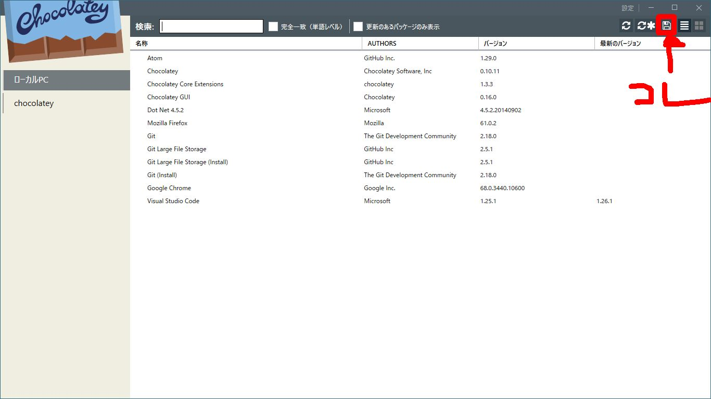

# Chocolateyを使ってWindowsでパッケージ管理する

# はじめに
LinuxのaptやyumのようにWindowsでもコマンドでソフトウェアのパッケージ管理を行う。

# パッケージ管理の利点
* インストーラを取ってきてGUIで次へ次へとやらなくて良くなる
* 複数台のWindows PCでのソフトウェアのインストール状況（パッケージやバージョン等）が合わせられる

# インストール方法
公式サイト参照
https://chocolatey.org/install

## ダイレクト接続でコマンドプロンプトでインストール
@"%SystemRoot%\System32\WindowsPowerShell\v1.0\powershell.exe" -NoProfile -InputFormat None -ExecutionPolicy Bypass -Command "iex ((New-Object System.Net.WebClient).DownloadString('https://chocolatey.org/install.ps1'))" && SET "PATH=%PATH%;%ALLUSERSPROFILE%\chocolatey\bin"

## プロキシ環境でのインストール方法
1. セットアップスクリプトのダウンロード
```
https://chocolatey.org/install.ps1
```
2. powershellを管理者権限で実行する
3. 以下のコマンドをpowershellで叩いてスクリプトを実行可能にする
```
Set-ExecutionPolicy RemoteSigned
```
4. プロキシを通す(IPとポートは自分の環境で置き換える)
```
$env:chocolateyProxyLocation = 'http://serverip:port'
```
5. シェルを実行する
```
.\install.ps1
```

# ソフトウェアのインストール方法
インストールが終わったら、管理者権限で実行されたpowershellもしくはコマンドプロンプトでコマンドを打つことでソフトのインストールが行えます。

```
choco install package_name -y
```

例えば、git for windowsのインストールは以下。

```
choco install git.install -y
```

## GUIフロントエンドの利用
コマンドを打つのは、インストールしたいソフトが明確なときは便利なのですが、そもそもどんなソフトがあるのかわからないし、名称もわからない場合は検索します。
GUIのフロントエンドを利用するのが便利なので、以下のコマンドで導入しておきましょう。

```
choco install chocolateygui
```

インストールが完了するとスタートメニューからChocolatey GUIを選択すると画像のようなGUIソフトが起動します。


1. chocolateyをクリックするとソフトの一覧が取得される
2. 一覧から選択するか、検索で絞り込んでインストールしたいソフトを選択する
3. インストールする

なれるまではGUIで検索して、一個ずつインストールしていくのが楽だと思います。

# ソフトウェアの更新
以下のコマンドでchocolateyでインストールしたソフトを一括更新してくれます。

```
cup all -y
```
git for windowsは頻繁に更新されるのでその度にインストーラをポチポチするのが、コマンド一発で更新されるのはかなり便利だと思います。

# GUIを使ってインストール済みのパッケージの一覧を出力
GUIを使うと導入済みのパッケージの一覧をconfigファイル(xml形式)に出力できます。
画像のボタンを押すことで出力されます。


chocolateyはconfigファイルを使ってパッケージの一括インストールができます。
なので、エクスポート機能で出力したconfigを別PCに移して一括インストールをすることで複数台のPCにパッケージを簡単に導入できます。

## xmlからの一括インストール
list.configというファイルを使って一括インストールするコマンド

```
choco install list.config
```
# installとportableのどちらを選択するか
パッケージを検索していると同じパッケージでも(Install)と(Portable)とついているのを見かけると思います。

[github](https://github.com/chocolatey/choco/wiki/ChocolateyFAQs#what-distinction-does-chocolatey-make-between-an-installable-and-a-portable-application)によると違いはインストールがあるかないかのようです。

普段インストーラーでProgram Filesにインストールしているものはinstallを選択するとよいと思います。
portableだとc:\ProgramData\chocolatey\libに実行ファイルが展開されるようです。

exeと同じディレクトリにini等の設定ファイルや、作業フォルダを作るようなものはportableを選ぶと良いでしょう。
VirtualStore機能でハマるのを回避できると思います。

例えばTomcatは設定や公開用のフォルダがデフォルトでexeと同じディレクトリに作成され、Program Filesにインストールするのはあまりよい選択ではありません。
portableはありませんでしたが、オプションで指定することでインストール先を変更できるようです。

```
choco install tomcat -params "unzipLocation=*path*"
```

# ChocolateyToolsLocationを設定する
[chocolatey doc](https://chocolatey.org/docs/helpers-get-tools-location)によると、Program Filesにインストールするのが適切でないソフトは、環境変数ChocolateyToolsLocationで指定したディレクトリにインストールされるようです。
この種類のソフトは、環境変数が作られていないと自動でc:\toolsに設定されて、c:\toolsにインストールされます。

cmderがこれに該当していました。

インストーラなしのソフトのインストール先を自分で固定している場合は、そのディレクトリをChocolateyToolsLocationに指定しておくと良いでしょう。
