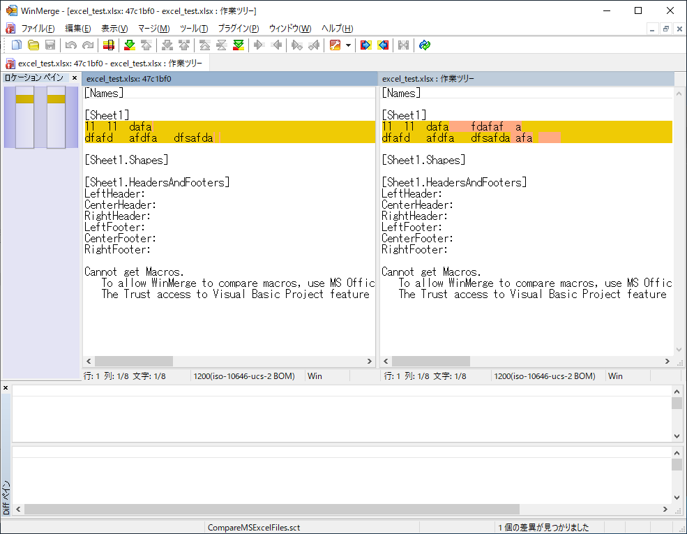

# TortoiseGitでMS Officeファイルのバージョン管理を行う

# はじめに
文章を作るのにMicrosoft Officeを使うことが多くあると思います。
一回作って終わりのファイルであればよいのですが、仕事や研究等で継続的に作成したファイルを更新を続けるようなケースではバージョン管理を行いたいです。

ツールを使わずに手動で履歴管理をやろうとすると、thesis_rev1.docx、thesis_提出前レビュー時.docx、などというようなファイルがフォルダの中に大量に出来てどれが最新かわからないというのは考えられるケースではないでしょうか。

本記事ではツールを使ってソースコードのバージョン管理と同じようにOfficeのバージョン管理を行う方法について紹介します。

# ツール導入
バージョン管理ツールにGitを使用します。
ただし、Officeのファイルはバイナリなので、そのままだと差分見てもわけがわからないので補助ツールとして、TortoiseGitと、WinMergeを使います。
とりあえず、これらをデフォルトでインストールしておきます。

記事作成時点で使用しているツールのバージョンと取得先は以下です。

## 使用ツール
- [Git for Windows v2.20.1](https://gitforwindows.org/)
- [TortoiseGit v2.7.0](https://tortoisegit.org/)
- [WinMerge v2.16.0.0](https://winmergejp.bitbucket.io/)

# GitでのOfficeファイルのバージョン管理
ソースコードなどの管理と何も変わりません。
Gitのリポジトリにファイルを追加して管理します。

TortoiseGitを使用してコミットをすると以下のような画面が出てきて、コミットする予定のファイルが表示されます。ダブルクリックすると差分が確認されます。

## 仕組み
TortoiseGitで拡張子毎に、差分を見る方法が設定されています。
デフォルトでは、Officeで開いて変更箇所を表示するように設定されています。
設定箇所は図を参照

# Officeの機能を使った差分確認
TortoiseGitをインストールして特に設定を変更していない場合はこちらになります。

Officeの機能を使って差分表示をしているので、該当するソフトウェアが立ち上がります。

適当に作ったファイルで変更を確認している様子を画像で貼ります。

## Word

## Excel

## PowerPoint

# WinMergeによる差分確認
WinMergeを入れて、TortoiseGitの設定を変更して、WinMergeで差分を確認する設定にしているとWinMerge上で確認出来ます。

## Word

## Excel

## PowerPoint

変更箇所がテキストで確認できるのでこちらの方が差分を見るのは良いと思います。

# おわりに
バイナリだろうが、バージョン管理しよう
