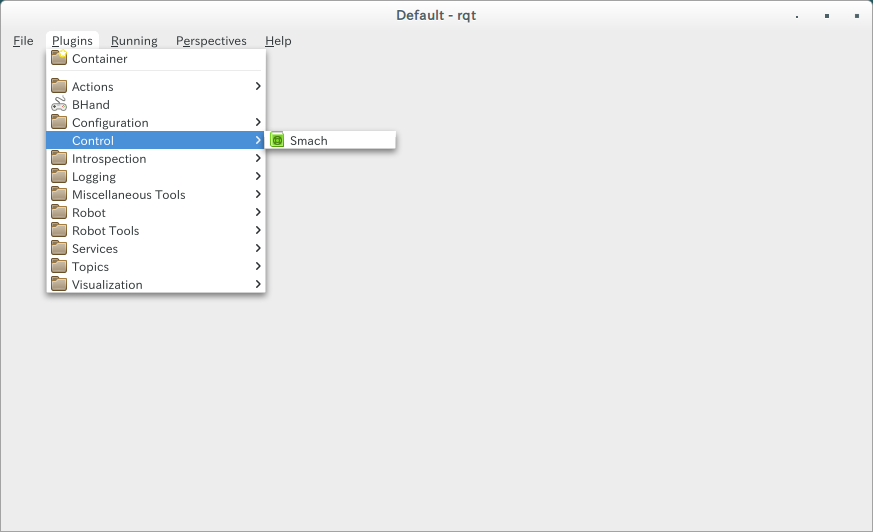

# はじめに
ROSでステートマシンを作るのに[smach](http://wiki.ros.org/smach)ライブラリが使用される。

状態を可視化するために[smach_viwer](http://wiki.ros.org/smach_viewer)
がある。

smach_viewerは独立した画面で起動してくるが、rqt内で呼びたくなったので、rqt内で動かす手順を解説する。

# rqt_smach
rqt_smachというパッケージで実現できる。

## インストール方法
[gistの解説](https://gist.github.com/matt3o/88bced95dba37a8932a51904d0734dff)の通りにインストールする。

使っているcatkin workspaceで以下を実行する。
ここでは、~/catkin_wsだとすると

```
cd ~/catkin_ws/src
git clone https://github.com/matt3o/xdot.git
git clone https://github.com/jbohren/executive_smach.git
git clone https://github.com/matt3o/executive_smach_visualization.git
cd ~/catkin_ws
catkin_make
```

これで、rqt_smachが使用できるようになっています。

# 使い方
1. 直接rqt_smachを起動する

```
rosrun rqt_smach rqt_smach
```

2. rqtを起動してから、プラグインを選択する(画像参照)

```
rqt
plugins→control→smach
```



